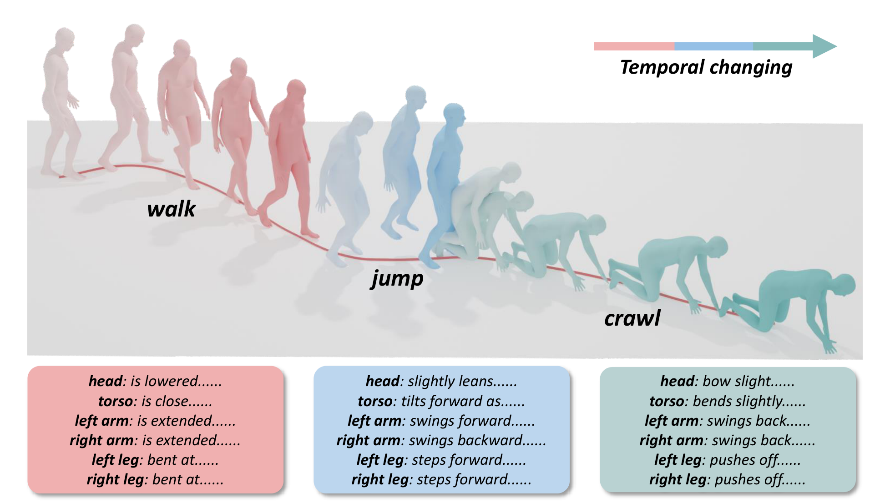

# FCMD: Fine-Grained Text-Driven Cohesive Motion Generation With Diffusion Model

This is the official PyTorch implementation of
**FCMD: Fine-Grained Text-Driven Cohesive Motion Generation With Diffusion Model**
([IEEE Xplore](https://ieeexplore.ieee.org/document/11456743)).

<p align="center">
  
</p>
<p align="center">
  <i>A generated motion sequence ("walk" &rarr; "jump" &rarr; "crawl"). Each segment is driven by a coarse caption together with fine-grained per-body-part descriptions (head / torso / left arm / right arm / left leg / right leg).</i>
</p>

Given a sequence of motion segments described by coarse captions together with fine-grained
per-body-part text descriptions, FCMD generates a long, coherent human motion sequence in an
autoregressive manner: a diffusion-based 1D UNet denoiser is conditioned on CLIP text features
fused with fine-grained text features (FiLM), and every newly generated segment is conditioned on
the previously generated motion to keep the whole sequence temporally consistent.

## Contents

- [Installation](#installation)
- [Data Preparation](#data-preparation)
- [Pretrained Models](#pretrained-models)
- [Training](#training)
- [Evaluation](#evaluation)
- [Inference / Visualization](#inference--visualization)
- [Results](#results)
- [Acknowledgement](#acknowledgement)

## Installation

Requirements: Linux, Python 3.9, CUDA 11.3 (any compatible PyTorch/CUDA pair should work).

```shell
conda create -n fcmd python=3.9 -y
conda activate fcmd

# PyTorch (matching your CUDA version)
pip install torch==1.12.1 torchvision==0.13.1 -f https://download.pytorch.org/whl/cu113

# Other dependencies
pip install -r requirements.txt
```

As an alternative, the exact environment used for our experiments is provided in
[`environment.yml`](environment.yml):

```shell
conda env create -f environment.yml
conda activate mogen
```

`ffmpeg` is required to export the visualization gifs (install it via conda/apt if missing).

## Data Preparation

### Training dataset
Download the **BABEL_TEACH** dataset and **STDM** dataset from the [ST2M release](https://github.com/Druthrie/ST2M).

### The fine-grained text
Download the fine-grained text: [BABEL_TEACH dataset](https://drive.google.com/file/d/1nEoGtyfWBakenKRrtj0JhaXP61G8GmxW/view?usp=drive_link) and [STDM dataset](https://drive.google.com/file/d/12yjJJmAwO5XRZQYrRTVQMN5dPYcRifoM/view?usp=drive_link) and place them in the corresponding dataset folder.

### Evaluation models

Download the pretrained
contrastive model for BABEL_TEACH from the [ST2M release](https://github.com/Druthrie/ST2M)
([Google Drive](https://drive.google.com/file/d/1_KCzpH6BA-7BnL2_QrkJa2CA_RQUAvWR/view?usp=sharing)) and arrange it as:

```text
data/pretrained_models/BABEL_TEACH/text_mot_match_M10_BABEL_TEACH/model/finest.tar
```

The GloVe word vectors used by the evaluation models are already included in [`glove/`](glove/).

## Pretrained Models

Download the pretrained weights of the released model `grained_text_fuse_film`
(model checkpoint at 50,000 iterations, EMA weights) from
[Google Drive](https://drive.google.com/drive/folders/1cs1ewx46RrevJ70vU7FGLAVcMAiYhqLV?usp=drive_link)
and arrange them as:

```text
checkpoints/BABEL_TEACH/grained_text_fuse_film/
├── opt.txt
├── meta/
│   ├── mean.npy
│   └── std.npy
└── model/
    └── model_50000.tar
```

## Training


```shell
# single GPU (accelerate config for 1 process is provided in 1gpu.yaml)
accelerate launch --config_file 1gpu.yaml tools/train.py \
    --name grained_text_fuse_film \
    --dataset_name BABEL_TEACH \
    --num_train_steps 50000 \
    --model-ema
```


Checkpoints are saved to `checkpoints/<dataset_name>/<name>/model/` every `--save_interval`
(default 5000) iterations; training logs go to `log/` and can be viewed with tensorboard.

## Evaluation

Evaluation runs 20 repetitions of generation over the whole test set and reports
Matching Score, R-precision (top-1/2/3), FID, Diversity, Multi-Modality and Transition Score.

```shell
python tools/evaluation.py \
    --opt_path checkpoints/BABEL_TEACH/grained_text_fuse_film/opt.txt \
    --gpu_id 0 \
    --log_name grained_text_fuse_film
```

Results are written to `eval_log/BABEL_TEACH/grained_text_fuse_film.log`.
Use `--which_epoch` to evaluate another checkpoint, and `--gpu_id -1` to run on CPU.

## Visualization

Generate a motion from per-segment captions, target segment lengths and fine-grained text.
The fine-grained text file must contain **6 short phrases per segment**
(head / torso / left arm / right arm / left leg / right leg), see
[`examples/grained_text_example.txt`](examples/grained_text_example.txt).
The command below reproduces the teaser animation at the top of this page:

```shell
python tools/visualization.py \
    --opt_path checkpoints/BABEL_TEACH/grained_text_fuse_film/opt.txt \
    --text "sit down" "raise the right hand" "crawl" \
    --motion_length 60 40 60 \
    --grained_text_file examples/grained_text_example.txt \
    --result_path result/teaser.gif \
    --gpu_id 0
```

Notes:

- `--motion_length` gives the expected length (frames, 20 fps) of each segment; the maximum
  supported length is 196 frames.
- `--which_epoch`, `--num_inference_steps` (default 10) and `--diffuser_name` (default
  `dpmsolver`, see `config/diffuser_params.yaml`) can be adjusted as needed.

## Acknowledgement

This code is built on top of
[MotionDiffuse](https://github.com/MotrixLab/MotionDiffuse) and
[ST2M](https://github.com/Druthrie/ST2M).
We also thank the authors of
[StableMoFusion](https://github.com/Linketic/StableMoFusion)
for the diffusion-based motion generation framework whose code we referenced.
